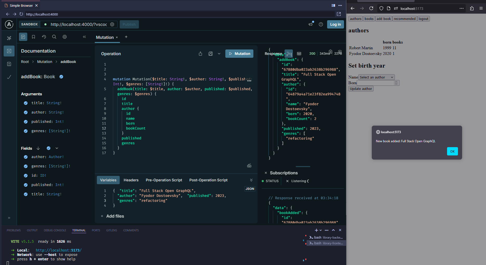

# Full Stack Open: GraphQL

This project is part of the Full Stack Open course. It consists of two main applications: a library management system and a phonebook application. Both applications have a backend built with Node.js, Express, and Apollo Server, and a frontend built with React and Apollo Client.

## Project Structure
- library-backend/  
- library-frontend/  
- phonebook-backend/  
- phonebook-frontend/  

### Library Management System

#### Backend

The backend for the library management system is located in the `library-backend` directory. It uses MongoDB for data storage and Apollo Server for the GraphQL API.

To start the backend server:

1. Navigate to the `library-backend` directory.
2. Install dependencies: `npm install`
3. Create a `.env` file with the following content:  
    ```
    MONGODB_URI=<your-mongodb-uri>  
    JWT_SECRET=<your-jwt-secret>
4. Start the server: `npm start`

#### Frontend

The frontend for the library management system is located in the `library-frontend` directory. It uses React and Apollo Client to interact with the GraphQL API.

To start the frontend application:

1. Navigate to the `library-frontend` directory.
2. Install dependencies: `npm install`
3. Start the development server: `npm run dev`

### Screenshot(s)


---

### Phonebook Application

#### Backend

The backend for the phonebook application is located in the `phonebook-backend` directory. However, due to significant changes during the course progression, the application can no longer be run as it is.

#### Note
The phonebook application has undergone significant changes throughout the course, and as a result, it is no longer functional in its current state. If you wish to explore the phonebook application, please refer to the course materials and follow the steps provided there to set up a working version.

## Learn More

For more information about the Full Stack Open course, visit the [course website](https://fullstackopen.com/en/part8/graph_ql_server).